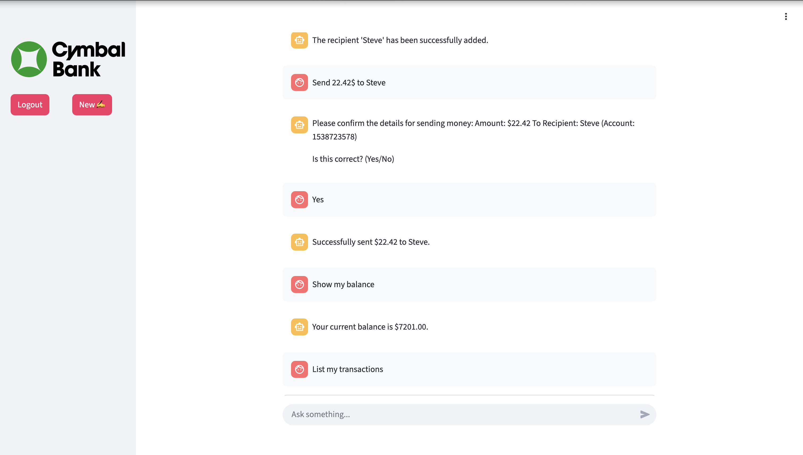
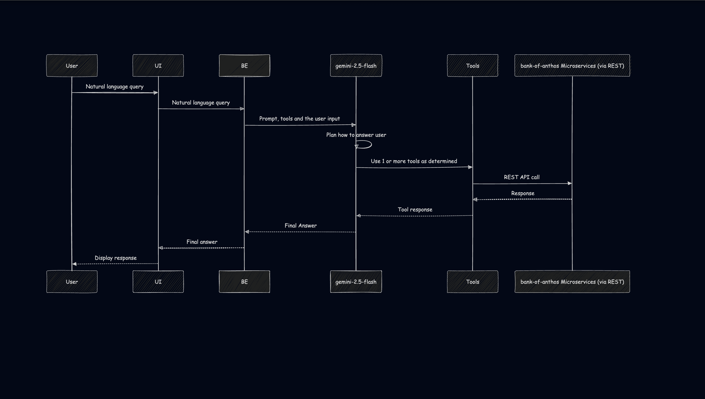

# Reactive Chat Bot

An AI-powered banking assistant that understands natural language and makes banking as easy as having a conversation. Check the demo [here](https://youtu.be/7Ig0z2ehZ_o?si=AMGmqsceYas8ImIX)



## Setup instructions

**Note:** As this is a customization, this demo requires you to first setup Bank of Anthos using this [link](https://github.com/GoogleCloudPlatform/bank-of-anthos/blob/main/README.md)

1. You need your Gemini API Key. You can get it [here](https://aistudio.google.com/apikey)
   Replace <YOUR_API_KEY> with your API Key and execute the following command:

```sh
echo -n '<YOUR_API_KEY>' | base64 | { read REPLACEMENT_VALUE; sed -i "s/GEMINI_API_KEY/$REPLACEMENT_VALUE/g" reactivechatbotboasecrets.yaml; }
```

Or for MAC use the following command:

```sh
echo -n '<YOUR_API_KEY>' | base64 | { read REPLACEMENT_VALUE; sed -i '' "s/GEMINI_API_KEY/$REPLACEMENT_VALUE/g" reactivechatbotboasecrets.yaml; }
```

2. Store the secrets in the GKE cluster by executing the following command.

```sh
kubectl apply -f reactivechatbotboasecrets.yaml
```

3. Create an Artifact Registry container image repository.

```sh
gcloud artifacts repositories create images \
    --repository-format=docker \
    --location=us-central1 --project=${PROJECT_ID}
```

4. Build and push docker image.

```sh
    docker build --platform linux/amd64  -t reactivechatbotboaservice:v1 .
    docker tag reactivechatbotboaservice:v1 ${REGION}-docker.pkg.dev/${PROJECT_ID}/images/reactivechatbotboaservice:v1
    docker push ${REGION}-docker.pkg.dev/${PROJECT_ID}/images/reactivechatbotboaservice:v1
```

OR

Use

```sh
us-central1-docker.pkg.dev/bank-of-anthos-chat/images/reactivechatbotboaservice:v1
```

5. Use the docker image you created and pushed. Get its value by executing the following.

```sh
echo ${REGION}-docker.pkg.dev/${PROJECT_ID}/images/reactivechatbotboaservice:v1
```

Replace YOUR_DOCKER_IMAGE_TAG in reactivechatbotboaservice.yaml with the value you got above

OR

Use

```sh
us-central1-docker.pkg.dev/bank-of-anthos-chat/images/reactivechatbotboaservice:v1
```

6. Run the reactive chat bot using the following command

```sh
    kubectl apply -f reactivechatbotboaservice.yaml
```

7. Access the Frontend of the reactive chat bot using its frontend's external IP.

```sh
    kubectl get service reactivechatbotboaservice-external | awk '{print $4}'
```


